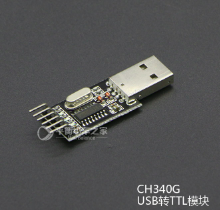
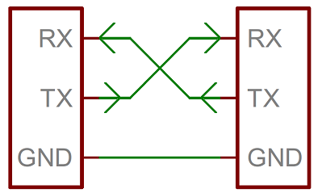
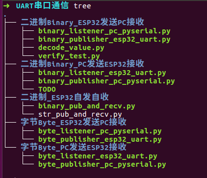

# MicroPython-ESP32串口通信

出品：1Z实验室 （1ZLAB： Make Things Easy）

## 概要

在本节课程阿凯为大家讲解了串口通信的接线方式，ESP32中的串口UART资源与相关API， 并给出了一个UART的小应用实例。


## 目录

* [串口通信](#串口通信)
* [硬件接线](#硬件接线)
* [UART构造器](#UART构造器)
* [UART的API讲解](#UART的API讲解)
* [ESP32串口自发自收实验](#ESP32串口自发自收实验)
* [课程预告](#课程预告)
* [推广](#推广)
* [参考文献](#课程预告)


## 串口通信


UART执行标准UART/USART双工串行通信协议，关于串口通信你需要的预备知识有`码元`， `波特率`， `奇偶校验`等概念。

可以在B站上观看[串口通信科普视频](https://www.bilibili.com/video/av27539932/). 

> TODO 英文的， 1Z实验室后面有精力也会考虑做一些科普视频


## 硬件接线

这里介绍的串口通信的使用方式不局限于ESP32开发板。

**两个单片机设备进行串口通信，或者单片机通过USB转TTL模块与PC进行串口通信**。

> 如果你对USB转TTL模块比较陌生的话，请打开淘宝自行搜索 USB转TTL模块 。

另外请留意USB转TTL的芯片型号，你可能需要安装其驱动。

我手里的这个USB转TTL的型号是CH340G， Ubuntu自带其驱动。





设备与设备之间至少需要接三个线。如下图所示：





> 关于USB转TTL

`GND`是地线，提供低电平的参考电压。 接下来就是`RX` 信息接收端， 还有`TX` 信息发送端。 单片机A的`RX` 接单片机B的`TX`，  单片机B的`RX` 接单片机A的`TX`。

**至于VCC接口，可接可不接, 如果USB转TTL的正负极接反了容易导致电脑主板的烧毁。 **

要注意他们两个单片机的工作电压是否匹配，例如ESP32的工作电压是3.3v那么另外一个VCC接口也只能接VCC。  有的USB转TTL模块有3.3v与5v两个接口， 可以将ESP32开发板的`VCC`与USB转TTL的3.3v接口相连接， 或者将ESP32的VIN接口与USB转TTL的5v接口相连接。


## UART构造器

不同于其他MicroPython开发板，**ESP32可以自定义管脚作为UART， 不过ESP32自身只有两个UART资源**。 


导入`UART` 模块

```python
from machine import UART
```

`UART`对象的构造器函数：

```python
UART(id, baudrate, bits, parity, rx, tx, stop, timeout)
```

* `id` : 串口编号

  ESP32的UART资源只有两个， id有效取值范围为`1,2` 

* `bandrate`:  波特率(时钟频率)

  常用波特率为： 

  * `9600`  （默认）
  * `115200`

  信息接受双方的波特率必须一致，否则会乱码。 

* `bits`：单个字节的位数(比特数)

  * `8` (默认)
  * `7`
  * `9`

* `parity`： 校验方式

  * `None` 不进行校验（默认）
  * `0` 偶校验
  * `1` 奇校验

* `rx`：接收口的GPIO编号

  在ESP32上面很多个管脚都可以自定义为UART管脚有效GPIO编号如下：

  ```
  0，2，4，5，9，10， 12-19， 21-23，25， 26， 34-36， 39
  ```

* `tx`：发送口的GPIO编号

  有效GPIO管脚编号同`rx`

* `stop`: 停止位个数

  * `1` （默认）
  * `2`

* `timerout`: 超时时间

  取值范围： `0 < timeout ≤ 2147483647`


**演示实例**

```python
from machine import UART
uart = UART(2, baudrate=115200, rx=13,tx=12,timeout=10)
```


## UART的API讲解


**字符串读写**

```python
uart.read(10)        # read 10 characters, returns a bytes object
                    # 读入10个字符， 返回一个比特对象
uart.read()            # read all available characters
                    # 读取所有的有效字符
uart.readline()        # read a line
                    # 读入一行
uart.readinto(buf)  # read and store into the given buffer
                    # 读入并且保存在缓存中
uart.write('abc')    # write the 3 characters
                    # 向串口写入3个字符abc
```


**字符读写**

```python
uart.readchar()     # read 1 character and returns it as an integer
                    # 读入一个字符
uart.writechar(42)  # write 1 character
                    # 写入ASCALL码为42的字符
uart.writechar(ord('*')) # 等同于uart.writechar(42)
```


**检测串口是否有数据**

```python
uart.any()          # returns the number of characters waiting
```


## ESP32串口自发自收实验


**接线 将开发板的 13号引脚与12号引脚用杜邦线相连接**

```python
'''
ESP32串口通信-字符串数据自发实验

接线 将开发板的 13号引脚与12号引脚用杜邦线相连接。

'''
from machine import UART,Pin
import utime

# 初始化一个UART对象
uart = UART(2, baudrate=115200, rx=13,tx=12,timeout=10)

count = 1

while True:
    print('\n\n===============CNT {}==============='.format(count))

    # 发送一条消息
    print('Send: {}'.format('hello {}\n'.format(count)))
    print('Send Byte :') # 发送字节数
    uart.write('hello {}\n'.format(count))
    # 等待1s钟
    utime.sleep_ms(1000)

    if uart.any():
        # 如果有数据 读入一行数据返回数据为字节类型
        # 例如  b'hello 1\n'
        bin_data = uart.readline()
        # 将手到的信息打印在终端
        print('Echo Byte: {}'.format(bin_data))

        # 将字节数据转换为字符串 字节默认为UTF-8编码
        print('Echo String: {}'.format(bin_data.decode()))
    # 计数器+1
    count += 1
    print('---------------------------------------')
```


**样例输出**

```
===============CNT 1===============
Send: hello 1

Send Byte :
8
Echo Byte: b'hello 1\n'
Echo String: hello 1

---------------------------------------


===============CNT 2===============
Send: hello 2

Send Byte :
8
Echo Byte: b'hello 2\n'
Echo String: hello 2

---------------------------------------


===============CNT 3===============
Send: hello 3

Send Byte :
8
Echo Byte: b'hello 3\n'
Echo String: hello 3

---------------------------------------

```

## 课程预告

上文讲解了如何使用ESP32的UART资源，如何发送与接收字符串。 如果后续深入学习的话，可能还涉及到：

1. PC串口调试助手的使用。
2. 自定义二进制通信协议。二进制数据打包与解包，需要用到python的的struct模块。
3. 使用PySerial让PC与ESP32进行串口通信


## 推广


扫码关注微信公众号**1Z实验室**， 回复关键词**ESP32串口通信** 获取更多源码样例。




出品：1Z实验室 （1ZLAB： Make Things Easy）

1Z实验室 Make Things Easy . 致力于在机器人+计算机视觉+人工智能的重叠区域, 制作小白友好的教程.


## 参考文献

[串口调试助手ubuntu桌面版](https://blog.csdn.net/jiangchao3392/article/details/73740841)

[uPyCraft-UART文档](https://dfrobot.gitbooks.io/upycraft_cn/content/3.2.6%20UART.html)