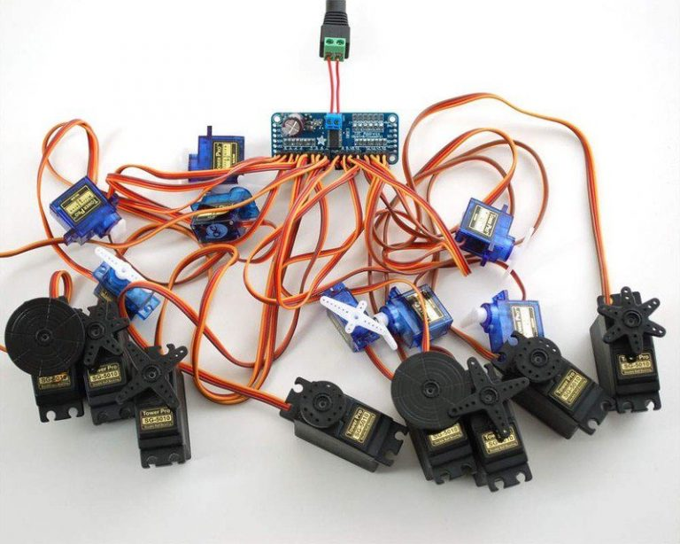
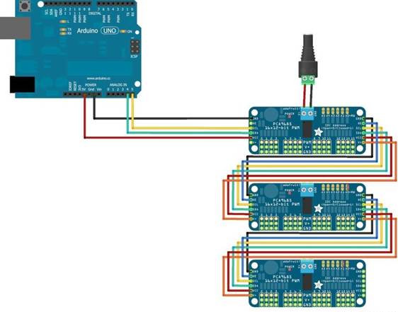

# PCA9685舵机与MicroPython-ESP32驱动

## 概要
阿凯在本文中讲解了如何使用MicroPython-ESP32通过PCA9685模块控制舵机旋转角度。同时也涉及到了MicroPython-ESP32的I2C资源与API讲解。

出品：1Z实验室 （1ZLAB： Make Things Easy）


## 目录

* [PCA9685模块简介](#PCA9685模块简介)
* [MicroPython驱动PCA9685](#MicroPython驱动PCA9685)
    * [上传库文件](#上传库文件)
    * [创建一个I2C对象](#创建一个I2C对象)
    * [创建Servos对象](#创建Servos对象)
    * [控制舵机的角度](#控制舵机的角度)


## PCA9685模块简介



**问题1：为什么我们要用到舵机驱动模块？**
1. `工作电压` 首先ESP32的工作电压是3.3v，不能直接驱动额定电压在5v-7.4v的数字舵机，需要外接电源。
2. `工作电流` 舵机工作电流在100MA~1.5A,运动越快电流越大，可能会损伤USB口.
3. `IO资源` 一般的开发板IO资源有限，例如控制一个6DOF的机械臂，需要占用六个IO口，如果是蛛形机器人的话需要用的也就更多，所以使用舵机驱动板是一种节省IO资源的方式。 

**问题2：什么是PCA9685？**

>PCA9685是一款基于IIC总线通信的12位精度16通道PWM波输出的芯片，该芯片最初由NXP推出时主要面向LED开关调光，但就目前国内的形式来看，好像在被Arduino在舵机控制领域使用的更广泛。 [stm32+pca9685控制舵机机械臂](http://www.eeworld.com.cn/mcu/article_2018061939818.html)


**问题3：单片机与PCA9685如何通信？**




PCA9685模块与单片机通过**I2C总线**的方式进行通信。
>I2C总线是由Philips公司开发的一种简单、双向二线制同步串行总线。它只需要两根线即可在连接于总线上的器件之间传送信息。

每个PCA9685都可以分配一个地址位,通过I2C接口，一个单片机可以控制最多64个PCA9685舵机控制板。每个舵机控制板上可以搭载16个舵机。
详细的使用说明见奇果派工坊的这篇文章，写的很详细。

[16路PWM舵机驱动板（PCA9685）的使用说明-奇果派工坊](http://www.7gp.cn/archives/64)


## MicroPython驱动PCA9685

Adafruit公司开源了MicroPython控制PCA9685模块的工程：
[micropython-adafruit-pca9685](https://github.com/adafruit/micropython-adafruit-pca9685)
这里我们需要用到这个工程里面的两个文件：
* [pca9685.py](https://github.com/adafruit/micropython-adafruit-pca9685/blob/master/pca9685.py)
* [servo.py](https://github.com/adafruit/micropython-adafruit-pca9685/blob/master/servo.py)


同时还有对应的开发文档：
[micropython-adafruit-pca9685开发文档](https://micropython-pca9685.readthedocs.io/en/latest/)

其中关于舵机驱动的API看这里：[Servo Driver](https://micropython-pca9685.readthedocs.io/en/latest/servo.html)


## MicroPython-ESP32驱动PCA9685

### 上传库文件
接下来讲MicroPython-ESP32与PCA9685。
首先将`micropython-adafruit-pca9685`中的`pca9685.py`与`servo.py`保存到本地，并通过`ampy`上传到ESP32的文件系统中。

### 创建一个I2C对象
在ESP32里面可以自定义引脚为I2C接口，支持I2C的管脚编号为：
```
0, 2, 4, 5, 9, 16, 17, 18, 19, 21, 22, 23, 25, 26, 27
```
>0号管脚还有2号管脚比较特殊，不推荐使用。

这里我们使用25号引脚作为SCL引脚(串行时钟线)，26号引脚为SDA(串行数据线)引脚。

**连接方式**
```
GND -> ESP32的GND （外接电源与ESP32共地）
SCL -> ESP32 D25
SDA -> ESP32 D26
VCC -> ESP32 3.3V
V+ -> 5v外接电源
```
**代码片段**

```python
from machine import I2C,Pin
gpio_scl = 25
gpio_sda = 26

# 初始化I2C
scl_pin = Pin(gpio_scl)
sda_pin = Pin(gpio_sda)
i2c = I2C(scl=scl_pin, sda = sda_pin, freq=10000) # 创建I2C实例
```

其中SCL时钟频率支持范围 `0 < freq ≤ 500000(Hz)`

### 创建Servos对象

从之前的`servo.py`引入`Servos`对象，**注意不是MicroPython自带的Servo.**
实例化的时候，传入我们上面创建的I2C对象，同时指定当前PCA9685模块的地址，默认是`0x40`, 你也可以通过焊接PCA9685模块上面的焊点修改地址编号。
```python
from servo import Servos
servos = Servos(i2c, address=0x40)
```

### 控制舵机的角度

设定舵机控制板上的舵机编号`servo_idx`， 有效范围为1-16
另外设置舵机舵机的角度`degree`。
> TODO 查看源码 确认degree的范围

```python
servos.position(servo_idx, degrees=degree)
```

项目实战请看[二自由度云台人脸追踪-MicroPython-ESP32+OpenCV](https://github.com/1zlab/1ZLAB_Face_Track_Robot)


## 舵机控制的原理

TODO

>舵机的PWM控制只跟脉宽有关，与占空比无关，一般0到180度对应0.5ms到2.5ms，不同厂家略有偏差，舵机在100HZ的PWM频率下也能很好地转动，只要保证脉宽在0.5ms到2.5ms间，不一定非要在50HZ下，只是如果频率太高的话舵机可能无法响应。

摘自[ PCA9685模块在51单片机的简单应用（舵机）](http://bbs.elecfans.com/jishu_1104135_1_1.html)


## 参考文章


* [16路PWM舵机驱动板（PCA9685）的使用说明-奇果派工坊](http://www.7gp.cn/archives/64)
* [micropython-adafruit-pca9685开发文档](https://micropython-pca9685.readthedocs.io/en/latest/)
* [stm32+pca9685控制舵机机械臂](http://www.eeworld.com.cn/mcu/article_2018061939818.html)
* [ PCA9685模块在51单片机的简单应用（舵机）](http://bbs.elecfans.com/jishu_1104135_1_1.html)


## 推广

出品：1Z实验室 （1ZLAB： Make Things Easy）

1Z实验室 Make Things Easy .  致力于在机器人+计算机视觉+人工智能的重叠区域, 制作小白友好的教程. 


